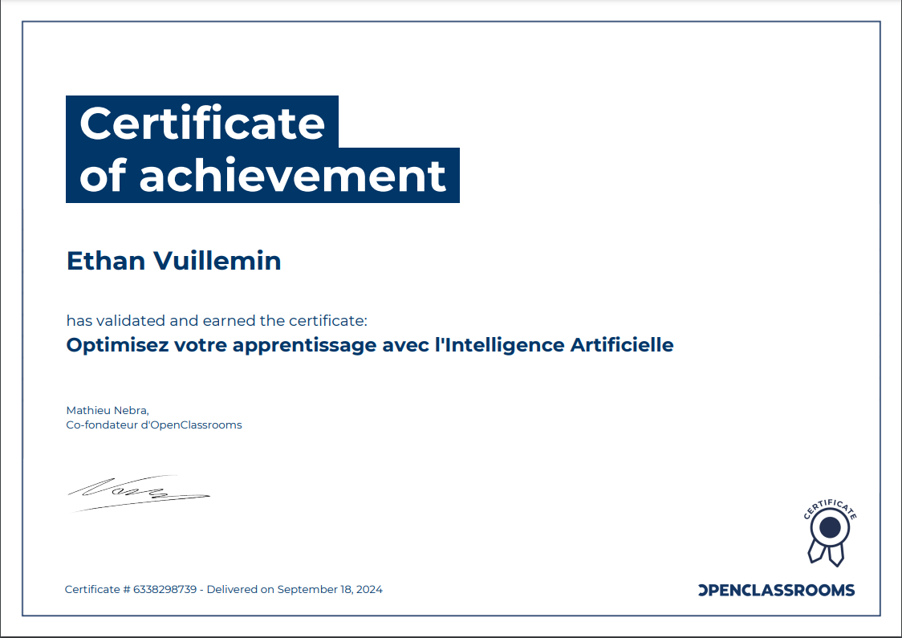
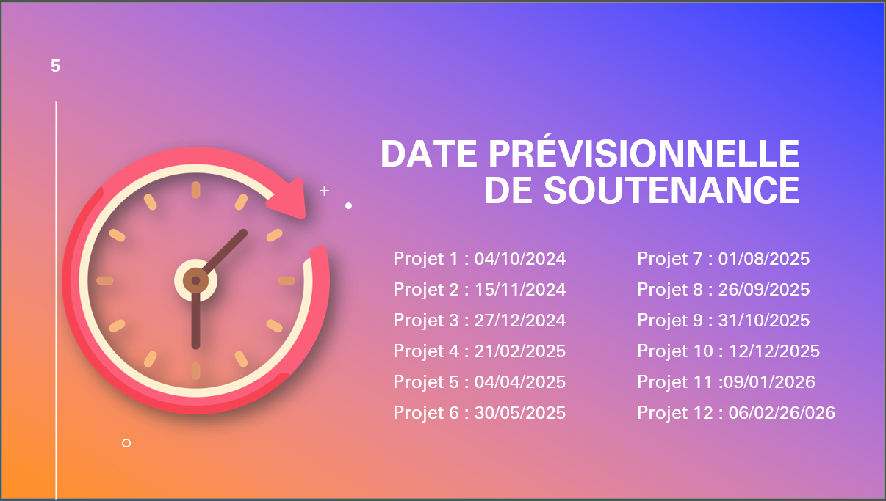

# Projet 1 - Démarrez votre formation de AI Engineer

Le projet 1 est le point de départ de votre parcours de formation chez OpenClassrooms. Son objectif principal est de vous aider à démarrer votre apprentissage et à poser les bases pour la suite de votre formation. Voici une présentation générale du projet 1 et ses objectifs

## Objectifs du projet :

- **Se familiariser avec le fonctionnement de votre formation chez OpenClassrooms** 

Vous allez découvrir le modèle pédagogique d'OpenClassrooms, comprendre comment la formation est structurée en cours en ligne et en projets pratiques, ainsi que le rôle de votre mentor.

- **Suivre le cours "Optimisez votre apprentissage avec l'Intelligence Artificielle"** 

Vous allez acquérir les bases sur l'Intelligence Artificielle (IA) et son utilité dans votre parcours professionnel. Ce cours vous aidera à améliorer votre apprentissage grâce à des techniques spécifiques.

- **Compléter votre [fiche de début de formation](./Vuillemin_Ethan_1_092024.pdf)**

Vous allez remplir une fiche qui vous aidera à planifier et organiser votre parcours de formation. Vous y définirez votre objectif professionnel et fixerez des dates cibles pour la réalisation de vos projets.

- **Participer à un webinaire de bienvenue**

Vous assisterez à une session en ligne où vous pourrez poser vos questions et obtenir des informations supplémentaires sur votre parcours de formation.

- **Choisir des outils de collaboration avec votre mentor** 

Vous discuterez avec votre mentor des outils que vous utiliserez pour communiquer, partager vos avancements et recevoir des feedbacks.

***Outils choisis:***

  
  

- **Passer en revue les projets et les thématiques de votre parcours** 

Vous aurez une vue d'ensemble des projets que vous réaliserez tout au long de votre formation, ainsi que des thématiques que vous aborderez.

- **Définir des dates cibles de soutenance de vos projets** 

En collaboration avec votre mentor, vous établirez des échéances pour chaque projet afin de vous aider à rester organisé et à suivre un calendrier réaliste.

- **Prévoir une session de bilan avec votre mentor** 

A la fin du projet 1, vous aurez un rendez-vous avec votre mentor pour discuter de votre objectif professionnel, des projets à venir, des dates cibles de projet et des outils de collaboration. Ce sera aussi l'occasion de poser toutes vos questions.